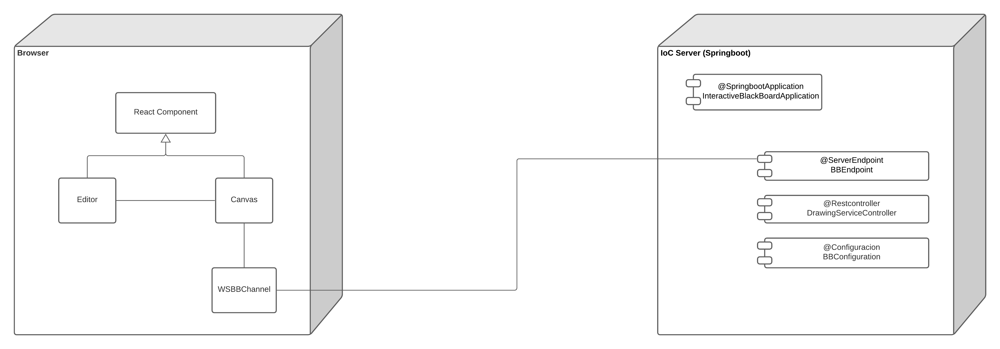

# Interactive BlackBoard
Aplicación que utiliza la nube de Heroku para desplegar un tablero interactivo, en donde,  dos personas podrán ver lo que la otra dibuja.

## Instrucciones de uso
### Prerrequisitos
* Git version 2.25.1
* Apache Maven version: 3.6.3
* Java versión: 1.8.0

### Ejecución
Para poder usar el proyecto desde tu maquina local debes clonar el proyecto subido en Github utilizando el siguiente comando desde una terminar que cuente con Git:
```
git clone https://github.com/Desarik98/InteractiveBlackboard
```

Luego de clonar el proyecto, por medio de la terminal se debe ejecutar el siguiente comando para generar las dependencias necesarias y poder ejecutar el proyecto, para esto es necesario tener instalado **Maven**
```
mvn package
```
A continuación, para ejecutar el programa se debe ejecutar el siguiente comando desde la terminal en el directorio del proyecto clonado

**Linux**
```
java -cp "target/classes:target/dependency/*" edu.escuelaing.arsw.interactiveblackboard.InteractiveBlackBoardApplication
```
**Windows**
```
java -cp "target/classes;target/dependency/*" edu.escuelaing.arsw.interactivewhiteboard.InteractiveBlackBoardApplication
```

## Diagrama de clases

* **React Component:** Estamos utilizando React para poder, mediante el uso de componentes, dibujar el tablero interactivo.
* **Editor:** Se usa para que se mencione el nombre de la persona que está dibujando.
* **Canvas:** Es el lienzo, mediante el framework p5.js, es creado y es donde el usuario podrá dibujar y ver el dibujo de la otra persona.
* **WSBBChannel:** El canal por donde pasaran los mensajes, en este caso los puntos dibujados por el usuario, para poder ser dibujados en el tablero del otro usuario, esta clase es la que hará la comunicación con el back.
* **InteractiveBlackBoardApplication:** Clase que corre el framework Springboot y hará la inyección de dependencias, en este caso del controlador, beans, endpoints y configuración.
* **BBEndpoint:** Clase que recibirá los mensajes, estos serán mandados por el canal WSBBChannel para que posteriormente sean dibujados.
* **BBConfiguration:** Clase que permite exportar los datos del endpoint /bbService.

## Pruebas de Usuario InteractiveWhiteBoard
Para comprobar el funcionamiento se debe ir al link [https://interactiveblackboard.herokuapp.com/]() en donde se encontrará el siguiente Home Page:


La persona podrá dibujar en el lienzo, pero mientras no haya otra persona conectada al tablero, esta no podrá ver lo que el usuario dibujó


Para comprobar la funcionalidad y que efectivamente el dibujo del primer usuario lo pueda ver otro usuario, se abrió una pestaña de incognito con el navegador que se este utilizando en este caso se utilizó Chrome y como se puede observar en ambos lados se pueden ver los dibujos de ambos.


## Tecnologias
* Maven
* Java
* Springboot
* Heroku
* React
* P5.js

## Autor
* Daniel Alejandro Mejía Rojas - Fecha: 29/06/2021

## Licencia
This project is licensed under the MIT License - see the LICENSE file for details